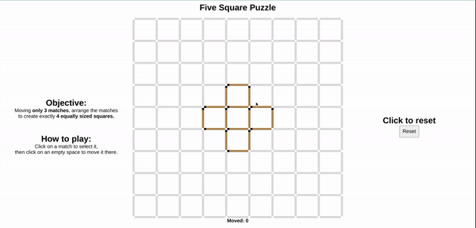

# zubiyasiddiqui.github.io

Designed clean and distraction-free experimental setup for psychology research studying the effects of boredom and mind wandering on problem solving. Head to [https://zubiyasiddiqui.github.io/Five-Square-Puzzle.htm?id=test](https://zubiyasiddiqui.github.io/Five-Square-Puzzle.htm?id=test) to try it out!

